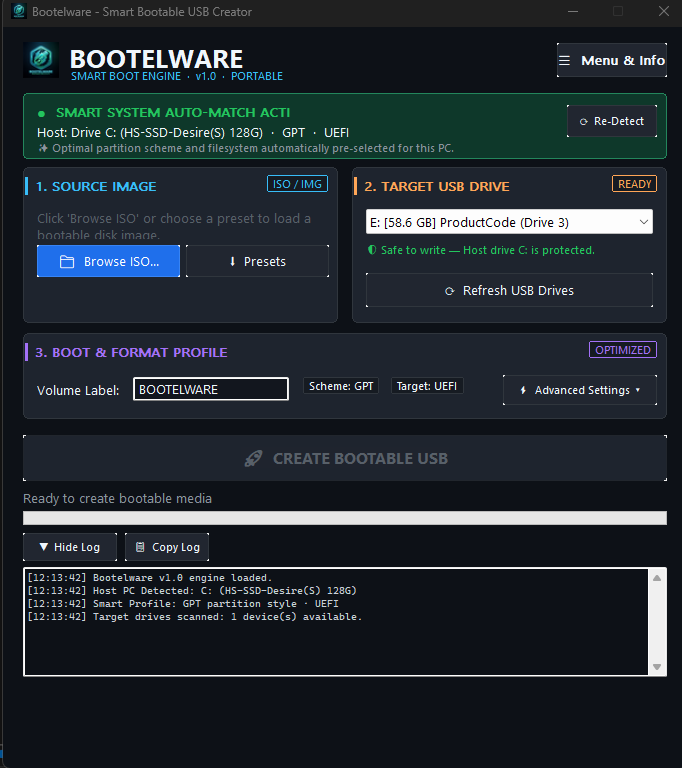
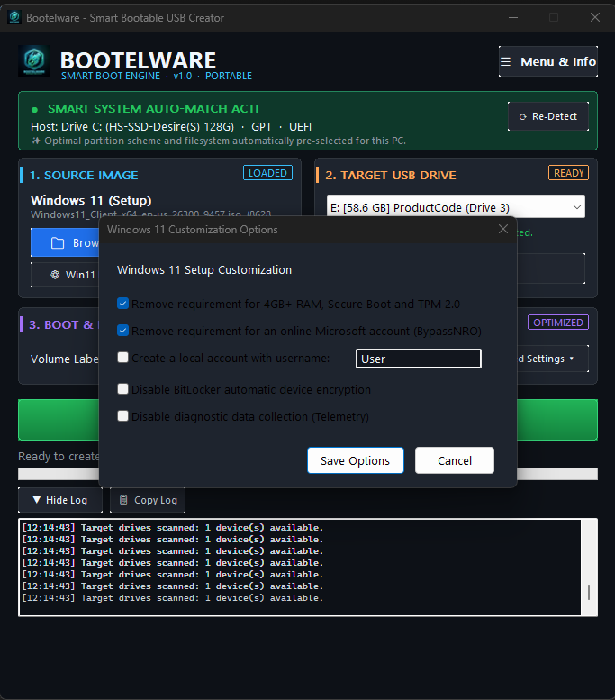

# Bootelware

<p align="center">
  <strong>High-Performance Bootable USB Creator for Windows</strong>
</p>

<p align="center">
  <a href="https://github.com/Md-Saim/Bootelware/blob/main/LICENSE"></a>
  
  
  
</p>

---

## Screenshots

### Main Interface


### Windows 11 Bypass Options


---

## Overview

**Bootelware** is a portable, single-executable Windows application that creates bootable USB drives from ISO images — Windows 11, Windows 10, Linux distributions, FreeDOS, rescue and diagnostic utilities.

Built entirely from scratch in **C++17** using the **Win32 API**, Bootelware is 100% original code with **zero external dependencies** and **zero runtime requirements**.

### 🚀 The Core Advantage — Smart System Detection

Unlike other tools where users must manually choose between **GPT** and **MBR** partition schemes (often leading to non-bootable drives), Bootelware features **Smart System Detection**:

1. At startup, Bootelware queries the physical drive hosting your active Windows installation (`C:`).
2. It detects the **partition style** (`GPT` vs `MBR`) and **firmware boot mode** (`UEFI` vs `BIOS`).
3. It **automatically applies** the matching settings:
   - **GPT Host** → Partition Scheme = GPT, Target System = UEFI (non-CSM)
   - **MBR Host** → Partition Scheme = MBR, Target System = BIOS or UEFI-CSM
4. If a user manually overrides these, Bootelware displays an explicit warning highlighting the divergence.

---

## Features

### Core Functionality
- **Smart System Detection (USP)** — Real-time inspection via Win32 `IOCTL_STORAGE_GET_DEVICE_NUMBER`, `IOCTL_DISK_GET_DRIVE_LAYOUT_EX`, and `GetFirmwareType`.
- **High-Throughput Write Engine** — Unbuffered direct I/O with sector-aligned writes for maximum speed.
- **Bad Blocks Detection** — Multi-pass pattern verification test across drive sectors.
- **Strict Device Isolation** — Fixed internal drives and the Windows system drive (`C:`) are automatically blacklisted to prevent accidental formatting.

### Windows 11 Setup Customization
- Bypass TPM 2.0, Secure Boot, and 4 GB+ RAM hardware checks
- Bypass CPU and storage requirements
- Remove mandatory Microsoft online account requirement (`BypassNRO`)
- Automatic local administrator account creation with custom username
- Disable BitLocker automatic device encryption
- Disable diagnostic telemetry collection

### Security & Verification
- **Cryptographic Image Checksums** — Hardware-accelerated MD5, SHA-1, SHA-256, and SHA-512 via Windows CNG (`bcrypt.dll`) with 1-click verification.

### User Experience
- **Modern Dark UI/UX** — Custom owner-drawn buttons, hover feedback, deep slate-zinc palette, Segoe UI typography.
- **Slide-Open Menu Drawer** — About Bootelware, Disclaimer, and Developer info with 1-click GitHub launch.
- **Custom Application Icon** — High-tech cyberpunk neon cyan & emerald USB rocket emblem (16×16 to 256×256).
- **Official ISO Download Hub** — Quick-access launcher for official Windows 11, Windows 10, Ubuntu, Debian, Fedora, and FreeDOS ISOs.

### Deployment
- **Zero Runtime Dependencies** — Statically linked CRT (`/MT`), standalone `.exe` under 1 MB.
- **Portable** — No installation required. Run from anywhere.

---

## Project Structure

```
bootelware/
├── CMakeLists.txt              # CMake build config with static CRT and UAC manifest
├── build.bat                   # Automated MSVC build script
├── assets/
│   └── screenshots/            # Application screenshots
├── resources/
│   ├── app.manifest            # UAC, DPI awareness, Common Controls 6
│   ├── resource.h              # Resource identifiers
│   └── bootelware.rc           # Windows resource definition
└── src/
    ├── main.cpp                # Application entry point (wWinMain) & DPI init
    ├── core/
    │   ├── system_detector.*   # System drive GPT/MBR & UEFI/BIOS detection
    │   ├── device_manager.*    # USB enumeration, volume mapping, safety guards
    │   ├── checksum.*          # Hardware-accelerated hash engine
    │   ├── iso_reader.*        # ISO 9660, UDF, El Torito, virtdisk mounting
    │   ├── win11_bypass.*      # autounattend.xml answer-file generator
    │   └── disk_writer.*       # Partitioning, formatting, bad blocks, I/O writer
    └── ui/
        ├── dark_theme.*        # Dark Mode theme, brushes, typography
        ├── dialogs.*           # Win11 options, checksums, ISO download dialogs
        └── main_window.*       # Main window, controls, event routing
```

---

## How to Build

**Requirements:** Visual Studio 2019+ with C++ Desktop Development workload, CMake 3.15+.

### Quick Build
```cmd
build.bat
```

### Manual Build
```cmd
cmake -B build -A x64
cmake --build build --config Release
```

The standalone executable is generated at:
```
build/Release/Bootelware.exe
```

---

## Technical Details

| Property | Value |
|---|---|
| **Language** | C++17 |
| **UI Framework** | Win32 API (no MFC, no WinForms, no Qt) |
| **Crypto Provider** | Windows CNG (`bcrypt.dll`) |
| **Disk I/O** | Direct unbuffered I/O, `SetupAPI`, `DeviceIoControl` |
| **CRT Linkage** | Static (`/MT`) |
| **Binary Size** | < 1 MB |
| **Target** | Windows 10 / 11 (x64) |
| **Admin Required** | Yes (UAC manifest embedded) |

---

## Author

**Md Saim**  
📧 [lakhvisaim@gmail.com](mailto:lakhvisaim@gmail.com)  
🔗 [github.com/Md-Saim](https://github.com/Md-Saim)

---

## License

This project is licensed under the **GNU General Public License v3.0** — see the [LICENSE](LICENSE) file for details.
