# 🤖 Bootelware

<p align="center">
  
</p>

<p align="center">
  <strong>Fast, Friendly & Foolproof Bootable USB Creator & Large FAT32 Formatter for Windows</strong>
</p>

<p align="center">
  <a href="https://github.com/Md-Saim/Bootelware/blob/main/LICENSE"></a>
  
  
  
  
  
</p>

---

## 🎨 Redesigned Playful UI Experience

Bootelware features a modern neo-brutalist / cartoon-clean interface crafted in pure C++ Win32 and GDI+. With friendly rounded cards, tactile drop-shadow buttons, a playful animated mascot, and intuitive 4-step wizard navigation, creating bootable media and formatting drives is simpler and more enjoyable than ever.

- **Fredoka Rounded Typography**: Powered by genuine Google Fonts **Fredoka** (weights 400 to 700) embedded directly into the binary resource table—no external font installations required.
- **Looping Mascot & Micro-Animations**: Continuous 30 FPS floating hover bob, antenna wiggle, natural eye-blinking cycles, progress bar shimmer, and pulsing step indicators.
- **Tactile Neo-Brutalist Buttons**: Physical press depression, hover elevation, and solid drop shadows across all buttons and interactive cards.
- **Zero UI Leaks / Layout Protection**: Strict GDI+ clipping boundaries and character-level ellipsis prevent long ISO filenames or verbose logs from overflowing.

---

### 📸 Application Walkthrough

| **1. Choose Source (ISO)** | **2. Pick USB Drive** |
|:---:|:---:|
| 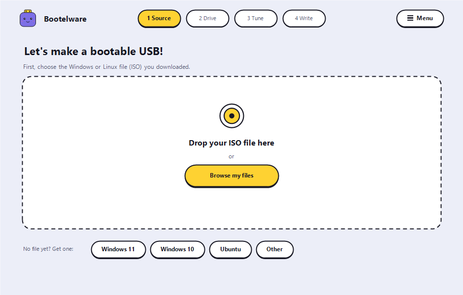 | 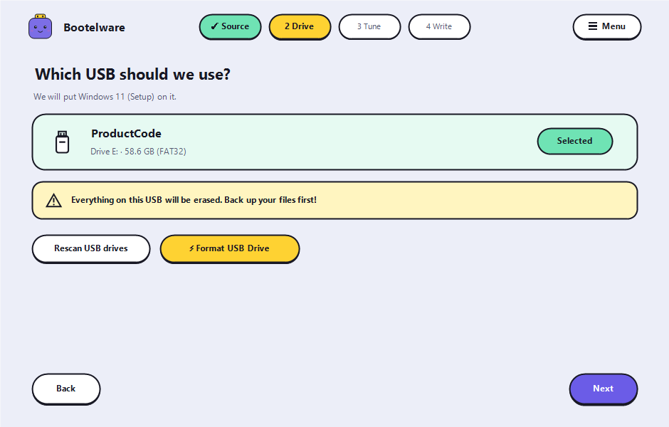 |
| Drag & drop ISO or browse files; 1-click OS links | Automatic drive detection & drive wipe safety warning |

| **3. Tune Extras & Partition Scheme** | **3b. Partition Mismatch Warning Pop** |
|:---:|:---:|
| 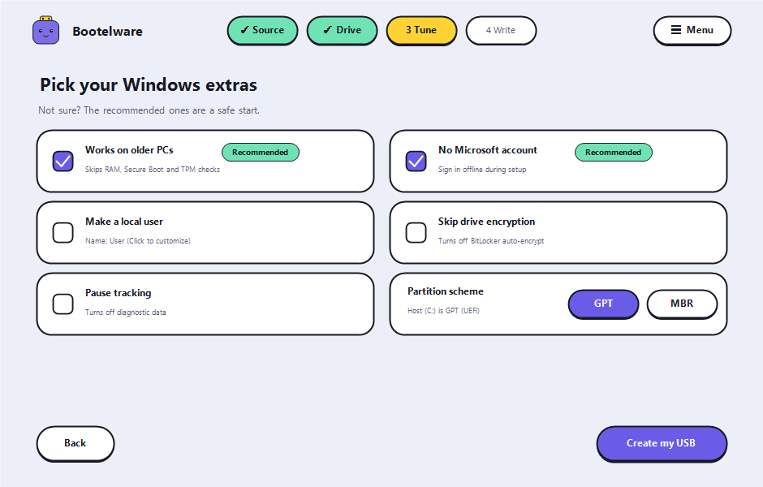 | 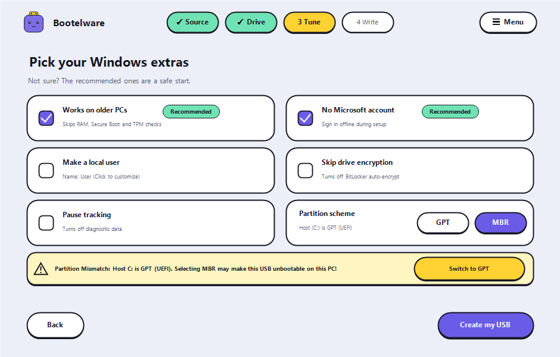 |
| Bypass TPM, RAM, MS account & toggle GPT / MBR | Warning pop banner when selected scheme differs from Host C: |

| **4. High-Speed Write & Progress** | **4b. Write Details (Zero Leaks)** |
|:---:|:---:|
| 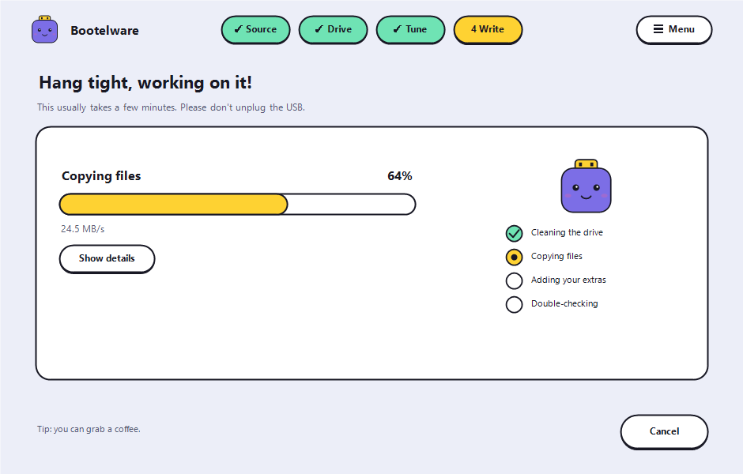 | 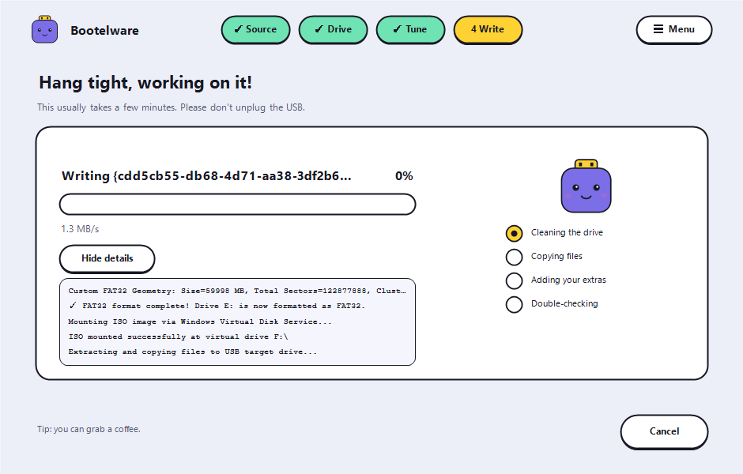 |
| Looping animated purple mascot, shimmer bar & checklist | Clipped log details & truncated task strings |

| **5. USB Ready to Boot!** | **⚡ Rufus-Style Large FAT32 Formatter** |
|:---:|:---:|
| 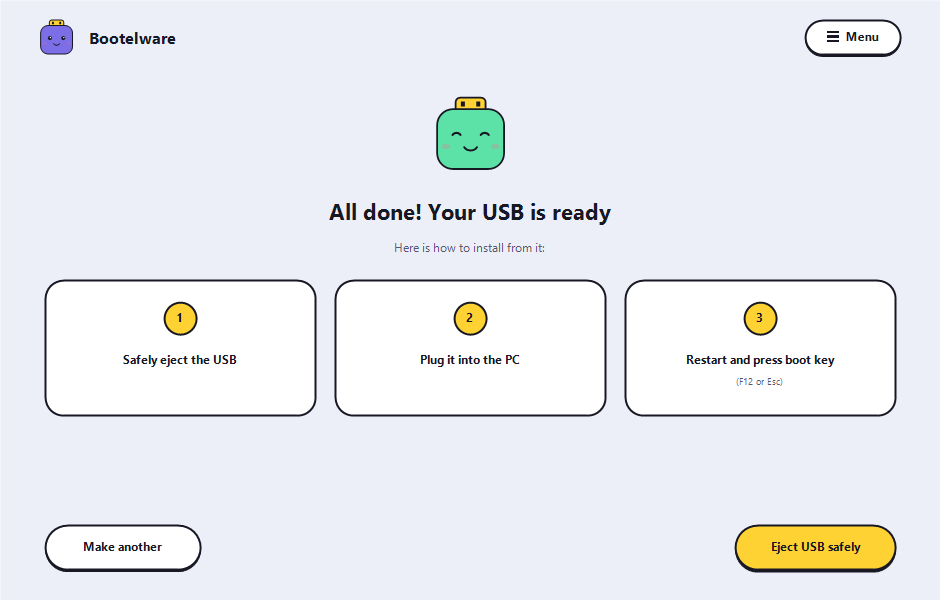 | 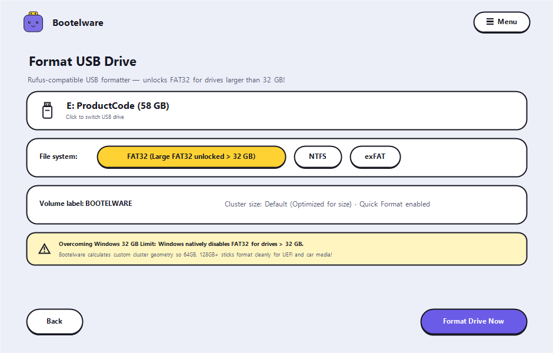 |
| Celebratory mint mascot & clear 3-step installation guide | Formats >32 GB USBs to FAT32, NTFS, or exFAT |

| **☰ Slide Menu** | **About Bootelware** | **About the Developer** |
|:---:|:---:|:---:|
| 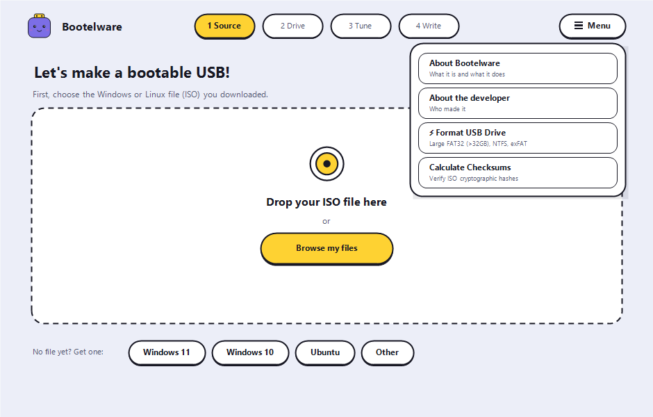 | 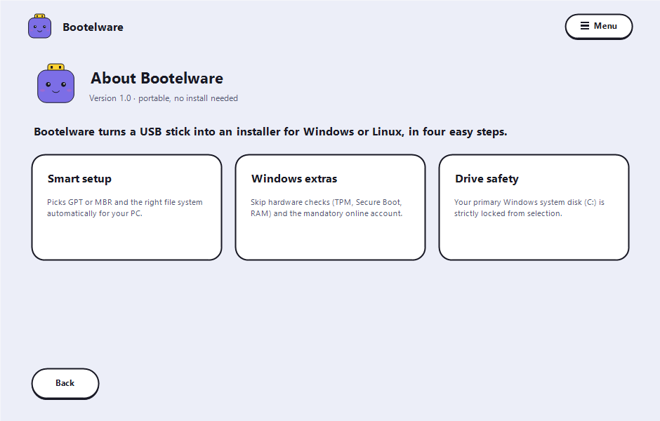 | 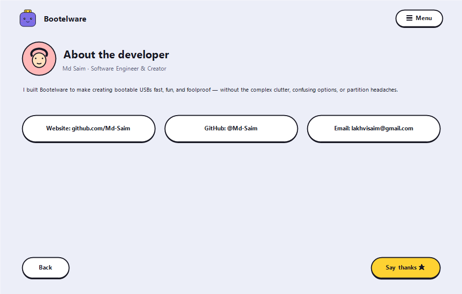 |
| Quick access to all tools & dialogues | Portable overview & smart setup info | Md Saim creator profile & direct links |

---

## 🚀 Key Features

### ⚡ Rufus-Style USB Formatter with Large FAT32 Support
- **Bypasses Windows 32 GB FAT32 Limit**: Windows natively hides/blocks the FAT32 option for drives larger than 32 GB. Bootelware calculates custom cluster geometries (16 KB for ≤64 GB, 32 KB for ≤128 GB, 64 KB for >128 GB) and formats USBs directly down to sector 0 (VBR, FSInfo, FAT tables).
- **Maximum Device Compatibility**: Allows 64 GB, 128 GB, 256 GB, and larger flash drives to work seamlessly on UEFI PCs, automotive infotainment dashboards, game consoles, and smart TVs requiring FAT32.
- **Multi-Format Support**: 1-click formatting to **FAT32 (Large Unlocked)**, **NTFS**, and **exFAT** with customizable volume labels and instant quick formatting.

### 🧠 Smart System Detection & Partition Scheme Switcher
- **Host System Inspection**: Detects host physical drive hosting your active Windows installation (`C:`), reporting whether it is `GPT (UEFI)` or `MBR (BIOS)`.
- **Interactive GPT / MBR Toggle**: Freely choose between **GPT** and **MBR** directly on the Tune screen.
- **Host Compatibility Warning Pop**: If you select a partition scheme that mismatches your current host PC (e.g., MBR on a GPT host), an interactive warning pop banner appears beneath the options explaining the compatibility risk, accompanied by a 1-click `[ Switch to GPT ]` fix button.

### 🪟 Windows 11 Setup Customization (Bypass Engine)
- Skip hardware checks: TPM 2.0, Secure Boot, and 4 GB+ RAM requirements.
- Skip mandatory Microsoft online account requirement (`BypassNRO`).
- Automatically configure a local administrator account (`User` or custom name).
- Skip BitLocker automatic drive encryption.
- Disable diagnostic telemetry collection.

### 🛡️ Safety & Verification
- **Strict Drive Isolation**: Internal system disks and host partitions (`C:`) are locked from selection to eliminate accidental overwrites.
- **Cryptographic Hash Engine**: Hardware-accelerated MD5, SHA-1, SHA-256, and SHA-512 verification via Windows CNG (`bcrypt.dll`).
- **Safe Ejection**: Safely unmounts and ejects USB storage media via `IOCTL_STORAGE_EJECT_MEDIA`.

---

## 🛠️ Project Structure

```
bootelware/
├── CMakeLists.txt              # CMake build config with static CRT
├── build.bat                   # Automated MSVC build script
├── assets/
│   ├── fonts/                  # Fredoka.ttf Google Font
│   └── screenshots/            # Exported UI screenshots for documentation
├── resources/
│   ├── app.manifest            # DPI awareness & Common Controls 6
│   ├── app_icon.ico            # High-res multi-layer application icon
│   ├── app_logo.bmp            # Playful mascot logo bitmap
│   ├── mascot_purple.png       # Playful mascot bot asset
│   ├── mascot_green.png        # Success smiling mascot bot asset
│   ├── dev_avatar.png          # Developer profile avatar
│   ├── Fredoka.ttf             # Embedded Fredoka variable font
│   ├── resource.h              # Resource identifiers (IDR_FONT_FREDOKA = 106)
│   └── bootelware.rc           # Windows resource definition (RCDATA embedded)
└── src/
    ├── main.cpp                # Application entry point & headless screenshot exporter
    ├── core/
    │   ├── system_detector.*   # System drive GPT/MBR & UEFI/BIOS detection
    │   ├── device_manager.*    # USB enumeration, volume mapping, safety guards
    │   ├── checksum.*          # Hardware-accelerated hash engine
    │   ├── iso_reader.*        # ISO 9660, UDF, El Torito, virtdisk mounting
    │   ├── win11_bypass.*      # autounattend.xml answer-file generator
    │   └── disk_writer.*       # Partitioning, Large FAT32 writer, unbuffered I/O
    └── ui/
        ├── dark_theme.*        # Neo-brutalist theme, Fredoka loader & tactile buttons
        ├── dialogs.*           # Checksums and helper modals
        └── main_window.*       # 8-screen wizard canvas, mascot animation & event pump
```

---

## 🔨 How to Build

**Requirements:** Visual Studio 2019+ with C++ Desktop Development workload, CMake 3.15+.

### Quick Build
```cmd
build.bat
```

### Manual Build
```cmd
cmake -B build -A x64
cmake --build build --config Release
```

The standalone executable is generated at:
```
build/Release/Bootelware.exe
```

### Export Documentation Screenshots
Bootelware includes a built-in headless renderer to capture high-res screenshots of all screens:
```cmd
build\Release\Bootelware.exe export-screens
```

---

## 📋 Technical Details

| Property | Value |
|---|---|
| **Language** | C++17 |
| **UI Engine** | Pure Win32 + GDI+ (No Electron, Qt, or external webviews) |
| **Typography** | Google Fonts Fredoka (Weights 400 to 700) embedded in binary |
| **Large FAT32 Engine** | Direct raw sector VBR / FSInfo / FAT32 table writer |
| **Crypto Provider** | Windows CNG (`bcrypt.dll`) |
| **Disk I/O** | Direct unbuffered I/O, `SetupAPI`, `DeviceIoControl` |
| **CRT Linkage** | Static (`/MT`) |
| **Binary Size** | < 1 MB standalone executable |
| **Target Platform** | Windows 10 / 11 (x64) |
| **Installation** | Fully portable (0 installation needed) |

---

## 👨‍💻 Author

**Md Saim**  
Software Engineer & Creator  
- 🌐 [GitHub: @Md-Saim](https://github.com/Md-Saim)  
- 📧 [lakhvisaim@gmail.com](mailto:lakhvisaim@gmail.com)  

---

## 📄 License

This project is licensed under the **GNU General Public License v3.0** — see the [LICENSE](LICENSE) file for details.
